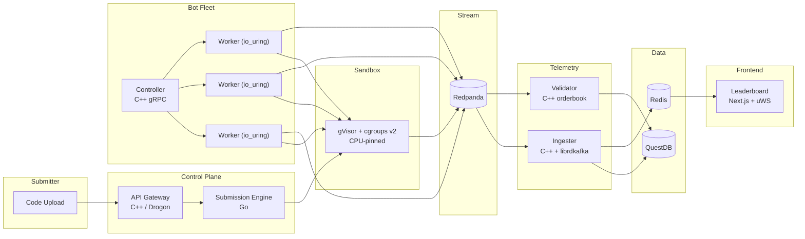
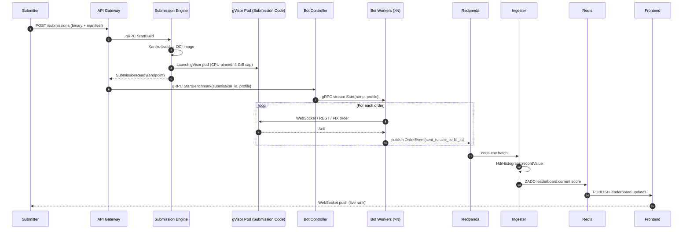

<div align="center">

# Velocity

### A distributed benchmarking platform for trading infrastructure

*Honest tail latency. Adversarial load. Production-grade engineering.*

</div>

---

## What is this?

**Velocity** is a self-hostable platform that benchmarks matching engines, execution
gateways, and any other low-latency trading component against an adversarial,
microsecond-honest load profile.

Submit a binary, Dockerfile, or source archive. Velocity sandboxes the artefact
with **gVisor**, pins it to dedicated CPU cores, and bombards it with a
distributed fleet of **C++ bots driving `io_uring`**. Every order is timestamped
at nanosecond resolution, every fill is replayed against a **reference
matching engine** for correctness, and a **live leaderboard** ranks each
submission on latency, throughput, and price-time-priority accuracy.

```
┌──────────────┐   ┌──────────────┐   ┌──────────────┐   ┌──────────────┐
│   UPLOAD     │──▶│  SANDBOX     │──▶│  BENCHMARK   │──▶│  SCORE       │
│  C++ / Rust  │   │   gVisor +   │   │  C++ Bot     │   │   Live       │
│  / Go binary │   │   cgroups    │   │  Fleet       │   │   Leaderboard│
└──────────────┘   └──────────────┘   └──────────────┘   └──────────────┘
```

## Why bother?

Most "load testers" lie about tail latency. They use closed-loop timing,
ignore [Coordinated Omission](https://www.youtube.com/watch?v=lJ8ydIuPFeU),
bottleneck on the load generator itself, and report p99s that are off by
orders of magnitude.

Velocity refuses to do any of that.

- **Open-loop load with intended-send-time correction** — measurements are defensible.
- **`HdrHistogram`** for percentile aggregation — mergeable, accurate to five significant figures.
- **`clock_gettime(CLOCK_MONOTONIC_RAW)`** timing — immune to NTP slewing and `adjtimex`.
- **`io_uring`** in the bot workers — the load generator is never the bottleneck.
- **gVisor sandbox** — untrusted submission code cannot reach the host kernel.
- **Per-core thread pinning + isolated CPUs** — measurements are reproducible.
- **W3C trace context end-to-end** — every benchmark is one Jaeger trace.

## Architecture



See [`docs/architecture.md`](docs/architecture.md) for the full blueprint and
[`docs/adr/`](docs/adr) for the decision records.

## The stack

| Layer | Technology | Rationale |
|-------|------------|-----------|
| Bot workers | **C++20** + `io_uring` + `uWebSockets` + hand-rolled FIX 4.4 | Nanosecond timing, zero-copy I/O |
| API gateway | **C++** / `Drogon` | One of the fastest HTTP frameworks ever benchmarked |
| Telemetry ingester | **C++** + `librdkafka` + `HdrHistogram` | Line-rate consumption, accurate percentiles |
| Correctness validator | **C++** + `Boost.Intrusive` | Deterministic replay against a reference orderbook |
| Scoring service | **C++** + Redis | Joins latency + correctness streams into composite scores |
| Leaderboard server | **C++** + `uWebSockets` | 100k+ concurrent WebSocket clients per core |
| Submission engine | **Go** + Kaniko + Kubernetes client | Pragmatic — orchestration is solved in Go |
| Frontend | **Next.js 14** + Tailwind + ECharts + framer-motion | Bloomberg × Linear hybrid theme |
| Event stream | **Redpanda** | C++ Kafka API — no JVM, lower P99 |
| Time-series DB | **QuestDB** | Built for trading data, microsecond timestamps, ILP ingest |
| Cache + leaderboard | **Redis** Sorted Sets + Pub/Sub | Canonical O(log N) ranking |
| Sandbox | **gVisor** (`runsc`) + cgroups v2 | Syscall interception, untrusted code safe |
| Orchestration | **Kubernetes** (k3d local, EKS prod) | One declarative target everywhere |
| IaC | **Terraform** + **Kustomize** | Declarative, reproducible, peer-reviewable |
| Observability | **Prometheus** + **Grafana** + **Jaeger / OTLP** | End-to-end traces of every order |

## Repository layout

```
platform/
├── .devcontainer/                 GitHub Codespaces / VS Code dev container
├── docs/                          Architecture, scoring, ADRs
│   ├── architecture.md
│   ├── scoring.md
│   ├── tracing.md
│   └── adr/                       Architecture decision records
├── proto/                         Cross-service contracts (gRPC + events)
├── services/
│   ├── api-gateway/               C++ — Drogon HTTP API
│   ├── submission-engine/         Go — Kaniko + Kubernetes orchestration
│   ├── bot-fleet/
│   │   ├── controller/            C++ — gRPC fan-out coordinator
│   │   └── worker/                C++ — io_uring load generator
│   ├── telemetry-ingester/        C++ — Redpanda consumer → QuestDB
│   ├── correctness-validator/     C++ — reference matching engine
│   ├── scoring-service/           C++ — joins latency + correctness → composite
│   └── leaderboard-ws/            C++ — uWebSockets live broadcast
├── frontend/                      Next.js — leaderboard + analytics
├── infra/
│   ├── compose/                   Local dev stack (Docker Compose)
│   ├── kubernetes/                K8s manifests + Kustomize overlays
│   └── terraform/                 Cloud provisioning (AWS EKS · GCP GKE · DigitalOcean)
├── scripts/
│   ├── sample-exchange/           C++ reference matching engine for testing
│   ├── bootstrap.ps1              Windows dev bootstrap
│   ├── dev-up.ps1                 Windows compose orchestrator
│   └── e2e-smoke.sh               End-to-end smoke test
├── cmake/                         Shared CMake modules + common C++ library
├── CMakeLists.txt                 Top-level C++ build
├── conanfile.py                   Conan 2.x dependency manifest
├── Makefile                       Unified developer workflow
└── docker-compose.yml             Entry point for `make up`
```

## Quick start

> **Prerequisites:** Docker Desktop 4.x or later (Linux containers). Every
> tool the platform needs runs inside containers — you do not need a local
> C++ toolchain, Go, or Conan installed.
>
> Full step-by-step procedure for a fresh laptop:
> see [`docs/SETUP.md`](docs/SETUP.md).

```bash
make bootstrap          # one-time setup: pull base images, generate protobuf code
make up                 # start the full dev stack (Redpanda + QuestDB + Redis + MinIO + services)
make logs               # tail logs from every service
make sample-submit      # submit the bundled C++ reference exchange as a test artefact
make bench              # run a benchmark against the test submission
open http://localhost:3000   # the live leaderboard
```

To run on Windows (PowerShell):

```powershell
.\scripts\dev-up.ps1 bootstrap
.\scripts\dev-up.ps1 up
.\scripts\dev-up.ps1 logs
```

### Run in the cloud (GitHub Codespaces)

No local Docker (or on Windows/macOS)? Push the repo and open it in a
**Codespace** — the [`.devcontainer/`](.devcontainer/README.md) provisions a
Linux box with Docker-in-Docker so the full stack, including the Linux-only
C++ services (`io_uring`, gVisor), builds and runs in the cloud. Pick a
**4-core / 16 GB** machine or larger. Step-by-step:
[`.devcontainer/README.md`](.devcontainer/README.md).

## Development loop

1. **Edit code on your host in any IDE.** The repository sits on your host filesystem.
2. **Builds and tests run in Linux containers.** `make build` invokes Conan + CMake inside a Linux image with `io_uring`, gVisor, and all native deps preinstalled.
3. **The live dev stack runs in Docker Compose.** Hot-reload for the frontend; rebuild-on-save for C++ services via `make watch`.

Why this split? Because `io_uring`, gVisor, `pthread_setaffinity_np`, and
`CLOCK_MONOTONIC_RAW` do not exist on macOS or Windows. The production target
is Linux Kubernetes; the dev environment matches.

## How a benchmark flows



## Scoring formula

The composite score is a weighted blend of three sub-scores:

$$
\text{score} = 0.40 \cdot s_{\text{throughput}} + 0.35 \cdot s_{\text{latency}} + 0.25 \cdot s_{\text{correctness}}
$$

Each sub-score is in `[0, 100]`. The latency component uses **p99** (not p50)
because tail latency is what matters in trading. See
[`docs/scoring.md`](docs/scoring.md) for the full rubric, penalties, and
tie-breakers.

## Engineering decisions worth defending

Every non-trivial choice has an ADR. Highlights:

- [**ADR-001**](docs/adr/001-gvisor-over-firecracker.md) — Why gVisor over Firecracker for sandboxing
- [**ADR-002**](docs/adr/002-cpp-on-the-hot-path.md) — Why C++ for everything on the measurement path
- [**ADR-003**](docs/adr/003-questdb-over-timescale.md) — Why QuestDB beats TimescaleDB for our write pattern
- [**ADR-004**](docs/adr/004-coordinated-omission.md) — How we avoid the Coordinated Omission trap
- [**ADR-005**](docs/adr/005-redpanda-over-kafka.md) — Why Redpanda is the lowest-latency Kafka wire-protocol

## Roadmap

This is an evolving personal-platform-grade project. The current branch ships
the full benchmarking loop end-to-end; the items on deck are:

- **Multi-tenant isolation per submission** (namespaced gVisor pools + bandwidth caps).
- **Symbol fan-out** — drive bots against multiple symbols concurrently.
- **Replay-from-pcap** — reproduce exact production load against a candidate engine.
- **Self-serve cloud deployment** via the bundled Terraform / EKS module set.

## License

MIT — see [`LICENSE`](LICENSE).
