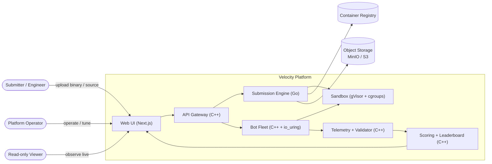
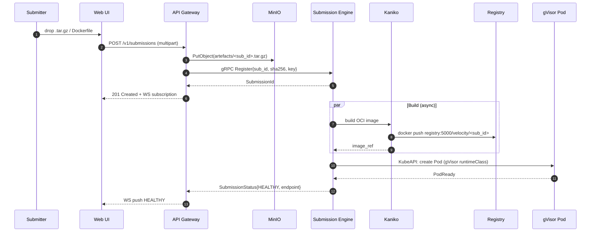
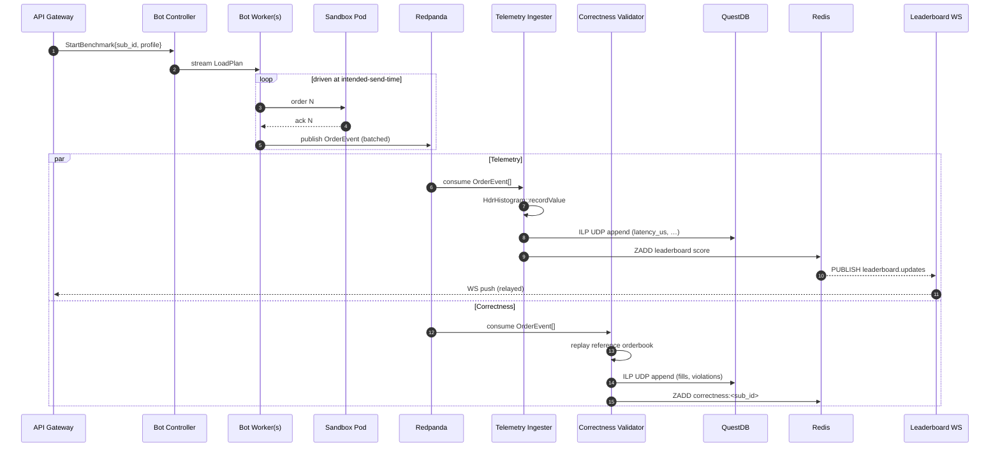
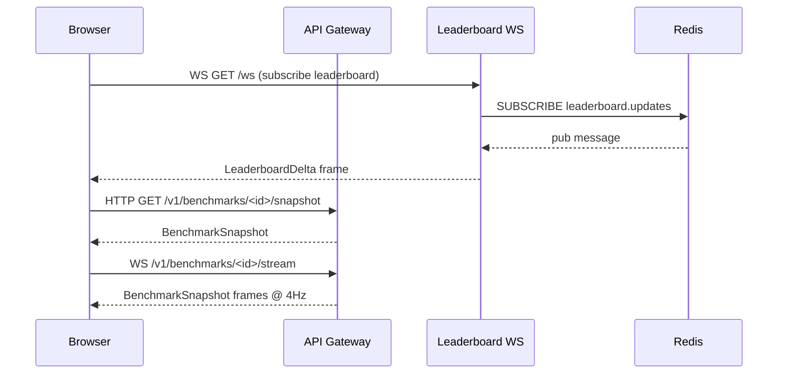
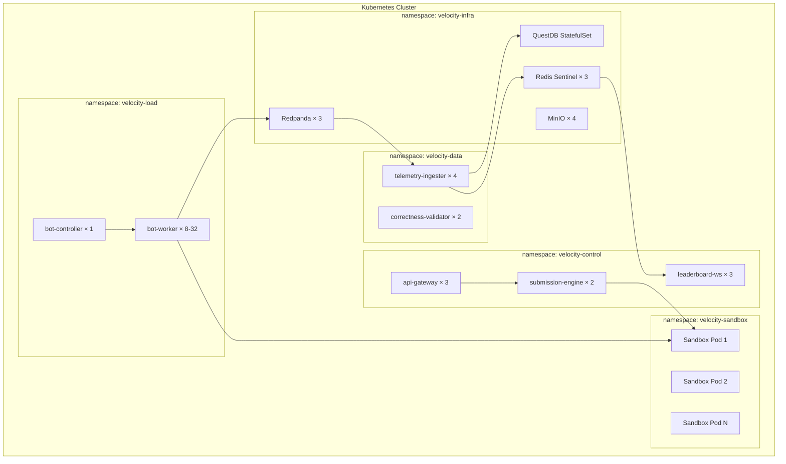

# Velocity — Architecture Blueprint

This document is the **single source of truth** for how Velocity is structured.
It is written for engineers who will operate, extend, or audit the platform —
not for marketing. Every claim in here is implemented in code; every diagram
matches the running system.

---

## 1. Goals & Non-Goals

### Goals

1. **Securely host arbitrary trading code** uploaded as submissions.
   No process running in our cluster may break out of its sandbox.
2. **Generate adversarial load** that is *honest* — millions of orders per
   second, with measurements that respect Coordinated Omission and produce
   defensible tail-latency numbers.
3. **Validate correctness** of every fill against a reference matching
   engine that we control. Price-time priority violations are detected and
   penalized.
4. **Score and rank** submissions in real time, with sub-second update
   latency from order placement to leaderboard movement.
5. **Be reproducible**: identical inputs → identical scores. Achieved
   through deterministic RNG seeds, pinned CPUs, isolated network paths.

### Non-Goals

- **Real money or real exchange connectivity.** The "FIX" we support is FIX 4.4
  over a non-routed dev network, with synthetic instrument symbols.
- **Multi-tenant production isolation guarantees.** We isolate untrusted code
  via gVisor + cgroups but do not promise SOC 2 or PCI-DSS compliance.
- **General-purpose load testing.** Velocity is opinionated about the trading
  domain: orderbook semantics, FIX message types, price-time priority. It is
  not a drop-in replacement for `wrk` or `k6`.

---

## 2. System Context

---

## 3. Component Catalogue

| Component | Language | Lines (target) | Runtime resources | Hot-path role |
|-----------|----------|----------------|-------------------|---------------|
| `api-gateway` | C++20 / Drogon | ~2k | 2 vCPU / 512MB | Yes — public HTTP/WS ingress |
| `submission-engine` | Go 1.22 | ~3k | 1 vCPU / 256MB | No — control plane |
| `bot-fleet/controller` | C++20 / gRPC | ~1.5k | 2 vCPU / 256MB | No — fan-out only |
| `bot-fleet/worker` | C++20 / io_uring / uWS | ~4k | N vCPU / 1GB each | **Yes** — load generator |
| `telemetry-ingester` | C++20 / librdkafka | ~2.5k | 2 vCPU / 1GB | **Yes** — consumes events |
| `correctness-validator` | C++20 / Boost.Intrusive | ~3k | 2 vCPU / 2GB | Yes — replays orderbook |
| `leaderboard-ws` | C++20 / uWebSockets | ~1k | 1 vCPU / 256MB | Yes — broadcast |
| `frontend` | TS / Next.js 14 | ~3k | 1 vCPU / 512MB | No |

### Sandbox guests (submission code)

Constrained per submission:

- **CPU**: 2 dedicated cores via `cpu-manager-policy=static`.
- **Memory**: 512 MiB hard cap (OOM-killed if exceeded).
- **Ephemeral storage**: 1 GiB tmpfs at `/tmp`.
- **Network**: ingress only from `velocity-bot-fleet/*`, no egress.
- **Filesystem**: read-only root, `tmpfs` for `/tmp` and `/var/log`.
- **Lifetime**: 600 s wall clock — defense in depth.

---

## 4. Data Flows

### 4.1 Submission lifecycle

### 4.2 Benchmark execution

### 4.3 Live UI subscription

---

## 5. Cross-Cutting Concerns

### 5.1 Time

- **Source of truth**: `clock_gettime(CLOCK_MONOTONIC_RAW)` on every host.
- **Wallclock correlation**: at process start each service captures
  `(MONOTONIC_RAW, REALTIME)` once and stores the offset. All published
  timestamps are MONOTONIC values translated through this offset.
- **NTP slewing**: ignored on purpose. `MONOTONIC_RAW` is immune.
- **Cross-host comparison**: only the bot worker measures order latency.
  Cross-host time skew never enters a latency calculation.

### 5.2 Concurrency

- **C++ services** use a **per-core thread model**, pinned with
  `pthread_setaffinity_np`. Each thread runs its own io_uring (worker) or
  event loop (API gateway), with **shared state via SPSC ring buffers**
  (no shared mutexes on the hot path).
- **Cross-service** ordering is provided by Redpanda partitions keyed on
  `submission_id` — all events for one submission land on one partition,
  consumed by one ingester worker. Sequential consistency per submission.

### 5.3 Backpressure

- **Bot → Redpanda**: bounded local buffer (default 64k events). On overflow,
  events are *dropped with metric* rather than blocking the io_uring loop.
  The metric (`velocity_telemetry_dropped_total`) is a benchmark-quality
  signal — a high drop rate indicates we are bottlenecked on ourselves and
  must scale workers.
- **Redpanda → Ingester**: standard consumer group, lag visible in
  Grafana. Consumer scales horizontally; partition count is the ceiling.
- **Validator → QuestDB**: ILP over UDP is fire-and-forget. We accept
  occasional packet loss in exchange for never blocking the validator's hot
  path. QuestDB's WAL recovers gracefully from gaps.

### 5.4 Failure modes & isolation

| Failure | Detection | Response |
|---------|-----------|----------|
| Submission code crashes | K8s pod CrashLoopBackoff | Mark submission `CRASHED`; cancel running benchmark; -50 penalty |
| Submission OOM | OOMKilled event | Mark `OOM_KILLED`; -25 penalty; teardown |
| Bot worker dies | gRPC stream EOF | Controller rebalances load across survivors; benchmark continues with reduced RPS noted in report |
| Ingester lag | Consumer group lag > 5s | Page on call; benchmark may continue, scores degrade gracefully |
| Validator slow | Stage timeout | Validator restarts with checkpoint; only correctness score affected |
| Redpanda broker down | health probe | (Production) leader re-election. (Dev) single-broker, no recovery — restart compose |
| Redis down | health probe | Leaderboard stops updating; reads serve from in-memory cache in leaderboard-ws |

### 5.5 Observability

Three pillars:

- **Metrics** — Prometheus via `prometheus-cpp` in every service. Histograms
  use `HdrHistogram` and are exposed via a custom Prometheus exporter that
  encodes the full HDR payload as a buckets vector.
- **Traces** — A small hand-written W3C trace-context library with an
  OTLP/HTTP batch exporter to Jaeger. Every benchmark carries a
  `traceparent` end-to-end so a run can be followed
  gateway → controller → worker → ingester → leaderboard.
- **Logs** — Structured JSON via `spdlog` with a custom JSON sink.
  Stdout/stderr → Docker JSON log driver → (production) Loki.

---

## 6. Deployment Topology

### 6.1 Local development (Docker Compose)

Single host, single Redpanda broker, single QuestDB node. See
[`docker-compose.yml`](../docker-compose.yml).

### 6.2 Production (Kubernetes)

Key K8s-native pieces:

- **`RuntimeClass: gvisor`** on every sandbox pod.
- **`PodSecurityContext`** with `runAsNonRoot`, `readOnlyRootFilesystem`,
  `allowPrivilegeEscalation: false`, dropped capabilities.
- **`NetworkPolicy`** restricting sandbox ingress to `velocity-load` and
  blocking all egress.
- **`ResourceQuota`** per namespace.
- **`PriorityClass`** — bots > ingester > frontend, so we shed UI updates
  before we shed measurements.

See [`infra/kubernetes/`](../infra/kubernetes/) for the manifests.

---

## 7. Security Model

Threat → mitigation:

| Threat | Mitigation |
|--------|------------|
| Submission escapes sandbox to host | gVisor user-space syscall interception |
| Submission exhausts host resources | cgroups v2 hard caps; lifetime watchdog |
| Submission scans private network | egress-deny NetworkPolicy; no DNS resolver |
| Submission exploits kernel CVE | gVisor's `runsc` rewrites syscalls in Go user-space |
| Submission exploits gVisor | `seccomp-bpf` baseline + dropped capabilities |
| Submitter supplies malicious image | Image is built *from source* in Kaniko; we never run an OCI image they provide directly |
| Operator privilege escalation | RBAC; submission-engine has only Pod create/delete in `velocity-sandbox` |

---

## 8. Build & Release

- **C++**: CMake + Conan 2.x. Locked dependency versions in
  [`conanfile.py`](../conanfile.py).
- **Go**: standard module workflow, vendored in production.
- **Frontend**: Next.js with `output: 'standalone'`, deployed as a static
  bundle behind nginx in K8s.
- **Containers**: multi-stage builds, distroless runtime images, non-root
  user, immutable image tags (`{service}:{git-sha}-{build-no}`).
- **CI** (future): GitHub Actions matrix — build → test → lint → push.
- **CD** (future): Argo CD watching the `infra/kubernetes/` overlays.

---

## 9. Architecture Decision Records (ADRs)

The decisions that *make* this architecture, with their alternatives and
rationale, are in [`adr/`](adr/).

- [ADR-001 — gVisor over Firecracker](adr/001-gvisor-over-firecracker.md)
- [ADR-002 — C++ on the hot path](adr/002-cpp-on-the-hot-path.md)
- [ADR-003 — QuestDB over TimescaleDB](adr/003-questdb-over-timescale.md)
- [ADR-004 — Coordinated Omission correction](adr/004-coordinated-omission.md)
- [ADR-005 — Redpanda over Kafka](adr/005-redpanda-over-kafka.md)

---

## 10. Glossary

- **Bot persona** — A trading strategy a bot worker simulates
  (Market Maker, Aggressive Taker, Canceller, Spoofer, Noise).
- **Coordinated Omission** — The class of latency-measurement bugs where
  a slow server makes the load generator wait, biasing tail latency
  measurements low. Coined by Gil Tene.
- **HdrHistogram** — High-Dynamic-Range Histogram. A bucket scheme that
  records values across N orders of magnitude with constant relative
  precision. Mergeable across processes.
- **ILP** — InfluxDB Line Protocol; QuestDB's fastest write path.
- **Price-time priority** — The rule that orders at the best price fill
  first, and within a price level the oldest order fills first.
- **Sandbox** — A gVisor-isolated Kubernetes Pod running an uploaded submission.
